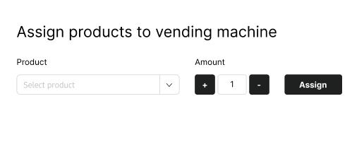
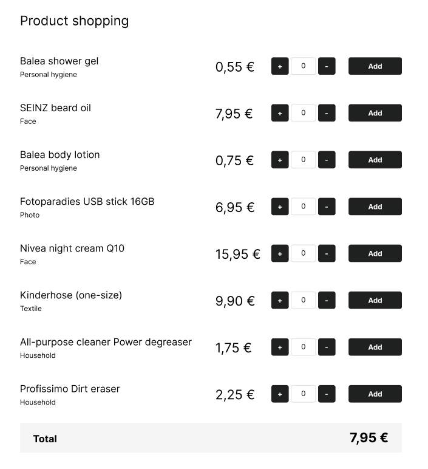

# Task

## The dm drugstore machine

You are tasked with implementing a simple drugstore machine that works like a vending machine and manages different products. The machine should be able to perform the following operations:

1. Fill the machine with products e.q. add 3 times the "Balea shower gel" to the machine
2. Allow customers to buy products and calculate the total price e.q. a user wants to buy 3 times the "Balea shower gel" and 1 time thr "SEINZ beard oil" the total price is 3 * 0,55 € + 1 * 7,95 € = 9,60 €
3. Enforce the constraint that customers can only buy as many products as there are in the machine. 

The machine should support the following products:

### Product 1:

* ID: 1
* Name: Balea shower gel
* Product group: Personal hygiene
* Price: 0,55 €

### Product 2:

* ID: 2
* Name: SEINZ beard oil
* Product group: Face
* Price: 7,95 €

### Product 3:

* ID: 3
* Name: Balea body lotion
* Product group: Personal hygiene
* Price: 0,75 €

### Product 4:

* ID: 4
* Name: Fotoparadies USB stick 16GB
* Product group: Photo
* Price: 6,95 €

### Product 5:

* ID: 5
* Name: Nivea night cream Q10
* Product group: Face
* Price: 15,95 €

### Product 6:

* ID: 6
* Name: Kinderhose (one-size)
* Product group: Textile
* Price: 9,90 €

### Product 7:

* ID: 7
* Name: All-purpose cleaner Power degreaser
* Product group: Household
* Price: 1,75 €

### Product 8:

* ID: 8
* Name: Profissimo Dirt eraser
* Product group: Household
* Price: 2,25 €

The backend of the application is already set up as a Spring Boot application with an in-memory HSQL database and Flyway for database migrations.
The initial migrations have already been created, including the [products table](./backend/src/main/resources/db/migration/V1__Initial.sql) and the [corresponding products](./backend/src/main/resources/db/migration/V2__Products.sql).
The frontend is set up as a simple Vite React TypeScript application.

Your task is to implement the necessary functionality in both the backend and frontend to fulfill the requirements mentioned above.
## Mockup
Mockup for Task 1: 

Mockup for Task 2 & 3:

